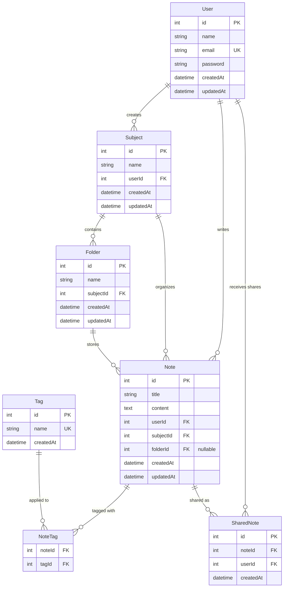

# Escape the Island – Full Stack Project

## 📌 Project Overview
This project is part of Sprint #1 and focuses on setting up a clean and scalable Next.js (TypeScript) application.  
The goal is to create a strong foundation that can easily grow as features are added in future sprints.

---

## 📁 Folder Structure

src/
├── app/ # Application routes and pages using Next.js App Router
├── components/ # Reusable UI components
├── lib/ # Utility functions, helpers, and configuration files


### Folder Explanation
- **app/**: Handles routing, layouts, and page-level components using the App Router.
- **components/**: Contains reusable UI components to avoid repetition and improve maintainability.
- **lib/**: Stores shared logic such as constants, helpers, and future API utilities.

This modular structure keeps the codebase clean and easy to scale.

---

## ⚙️ Setup Instructions

### Install dependencies
```bash
npm install

## 🧹 Code Quality & Consistency

### TypeScript Configuration
Strict TypeScript mode is enabled to catch potential bugs at compile time.  
Rules like `noImplicitAny` and `noUnusedLocals` help prevent unclear or unused code.

### ESLint & Prettier
ESLint ensures best practices and code correctness, while Prettier enforces consistent formatting.  
Custom rules prevent console logs, enforce semicolons, and standardize quotes.

### Pre-Commit Hooks
Husky and lint-staged ensure that all code is linted and formatted before commits.  
This prevents broken or inconsistent code from entering the repository and improves team collaboration.

---

## Docker & Local Development Setup

This project uses Docker and Docker Compose to create a consistent local development environment with all required services.

### Dockerfile

The `Dockerfile` defines how the Next.js application is containerized:

- **Base Image**: `node:20-alpine` — Lightweight Alpine Linux with Node.js 20
- **Working Directory**: `/app` — All commands run inside this directory
- **Dependency Installation**: Copies `package.json` and `package-lock.json`, then runs `npm install`
- **Build Process**: Copies source files and builds the Next.js app using `npm run build`
- **Port Exposure**: Exposes port `3000` for the application
- **Start Command**: Runs `npm run start` to serve the production build

### Docker Compose Services

The `docker-compose.yml` orchestrates three services:

#### **app** (Next.js Application)
- Builds from the local `Dockerfile`
- Container name: `nextjs_app`
- Ports: Maps `3000:3000` (host:container)
- Environment variables:
  - `DATABASE_URL`: Connection string for PostgreSQL
  - `REDIS_URL`: Connection string for Redis
- Depends on `db` and `redis` services to start first
- Connected to `localnet` network

#### **db** (PostgreSQL Database)
- Image: `postgres:15-alpine`
- Container name: `postgres_db`
- Always restarts on failure
- Environment variables:
  - `POSTGRES_USER=postgres`
  - `POSTGRES_PASSWORD=password`
  - `POSTGRES_DB=mydb`
- Ports: Exposes `5432` for database connections
- Uses named volume `db_data` for persistent storage
- Connected to `localnet` network

#### **redis** (Redis Cache)
- Image: `redis:7-alpine`
- Container name: `redis_cache`
- Ports: Exposes `6379` for Redis connections
- Connected to `localnet` network

### Network & Storage

- **localnet**: A custom bridge network that allows all services to communicate using service names (e.g., `db`, `redis`)
- **db_data**: A named volume that persists PostgreSQL data even when containers are removed

### Running the Setup

Start all services:
```bash
docker-compose up --build
```

Verify running containers:
```bash
docker ps
```

Stop all services:
```bash
docker-compose down
```

Remove all containers and volumes:
```bash
docker-compose down -v
```

---

---

## Database Schema Design

This project uses PostgreSQL with Prisma ORM to manage a normalized relational database for the CampusNotes application.

### Entity-Relationship Diagram



### Core Entities

#### User
Represents students or teachers who create and share notes.
- **Primary Key**: `id` (auto-increment)
- **Unique Constraint**: `email`
- **Relationships**: One-to-many with Subject, Note, and SharedNote

#### Subject
Academic courses or subjects (e.g., "Data Structures", "Calculus").
- **Primary Key**: `id`
- **Foreign Key**: `userId` → User
- **Unique Constraint**: `(name, userId)` - prevents duplicate subject names per user
- **Cascade Delete**: When a user is deleted, their subjects are also deleted

#### Folder
Organizational containers within subjects for grouping related notes.
- **Primary Key**: `id`
- **Foreign Key**: `subjectId` → Subject
- **Unique Constraint**: `(name, subjectId)` - prevents duplicate folder names per subject
- **Cascade Delete**: Deleted when parent subject is deleted

#### Note
The core content entity containing markdown-formatted academic notes.
- **Primary Key**: `id`
- **Foreign Keys**: 
  - `userId` → User (CASCADE delete)
  - `subjectId` → Subject (CASCADE delete)
  - `folderId` → Folder (SET NULL on delete - notes remain if folder deleted)
- **Indexes**: On `userId`, `subjectId`, `folderId` for fast lookups
- **Content**: Stored as TEXT for large markdown content

#### Tag
Reusable labels for categorizing notes (e.g., "exam-prep", "important").
- **Primary Key**: `id`
- **Unique Constraint**: `name` - tags are globally unique
- **Many-to-Many**: Connected to Notes via NoteTag junction table

#### NoteTag (Junction Table)
Implements many-to-many relationship between Notes and Tags.
- **Composite Primary Key**: `(noteId, tagId)`
- **Cascade Delete**: Removed when either note or tag is deleted

#### SharedNote
Tracks note sharing between users.
- **Primary Key**: `id`
- **Foreign Keys**: `noteId` → Note, `userId` → User
- **Unique Constraint**: `(noteId, userId)` - prevents duplicate shares
- **Cascade Delete**: Removed when note or user is deleted

### Normalization

The schema follows **Third Normal Form (3NF)**:

- **1NF**: All attributes contain atomic values (no arrays or nested objects)
- **2NF**: No partial dependencies - all non-key attributes depend on the entire primary key
- **3NF**: No transitive dependencies - non-key attributes don't depend on other non-key attributes

**Design Decisions**:
- Tags are normalized into a separate table to avoid duplication
- Subjects and Folders have composite unique constraints to prevent duplicates within their scope
- Timestamps (`createdAt`, `updatedAt`) are automatically managed by Prisma

### Database Commands

**Run migrations**:
```bash
npm run db:migrate
```

**Open Prisma Studio** (visual database browser):
```bash
npm run db:studio
```

**Generate Prisma Client**:
```bash
npm run db:generate
```

**Reset database** (⚠️ deletes all data):
```bash
npm run db:reset
```

### Connection Details

- **Host**: `127.0.0.1`
- **Port**: `5433` (mapped to avoid conflicts with local PostgreSQL on 5432)
- **Database**: `mydb`
- **User**: `postgres`
- **Password**: `password`

---

## Schema Design Reflection

### Scalability Considerations

1. **Indexes**: Added on frequently queried foreign keys (`userId`, `subjectId`, `folderId`) to optimize JOIN operations and WHERE clauses
2. **Text Storage**: Note content uses PostgreSQL's TEXT type, supporting unlimited length for comprehensive academic notes
3. **Cascade Deletes**: Properly configured to maintain referential integrity without orphaned records
4. **Normalization**: 3NF design eliminates redundancy, reducing storage and update anomalies

### Common Query Patterns

The schema is optimized for these frequent operations:

1. **Fetch all notes for a user**: Index on `Note.userId`
2. **Get notes by subject**: Index on `Note.subjectId`
3. **Find notes in a folder**: Index on `Note.folderId`
4. **Search notes by tags**: Many-to-many via `NoteTag` junction table
5. **List shared notes**: `SharedNote` table with indexes on both foreign keys

### Trade-offs

- **Folder optionality**: Notes can exist without folders (`folderId` is nullable), providing flexibility
- **Tag reusability**: Global tag table means tags are shared across all users, improving consistency but requiring careful naming
- **Cascade vs. SET NULL**: Folders use SET NULL on delete to preserve notes, while subjects use CASCADE since notes without subjects lose context

---

## Challenges & Learnings


Docker ensures every team member runs the exact same environment, eliminating "works on my machine" issues. Common challenges include port conflicts (if 3000, 5432, or 6379 are already in use), initial build time for the Next.js image, and permission issues on Linux/Mac with volume mounts. Docker Compose simplified multi-service orchestration by handling networking, dependencies, and service startup order automatically. This setup significantly improves onboarding speed and reduces environment-related bugs.

